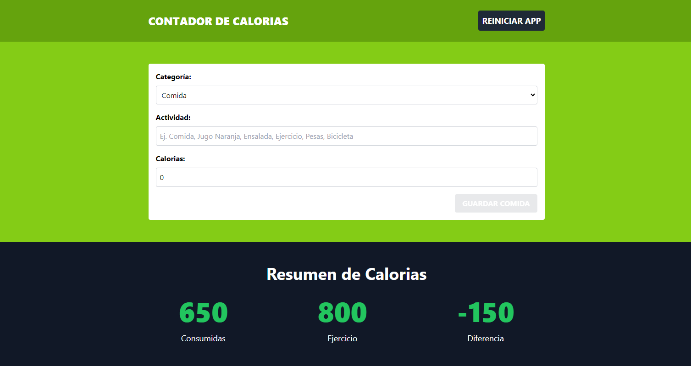
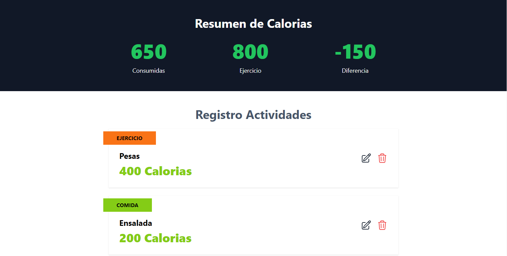

# Contador de Calorias

Es una aplicación que permite dar seguimiento a las calorias consumidas y gastadas.

## Herramientas de desarrollo

Para desarrollar la aplicación, se utiliza:

- React
- TypeScript
- Tailwind
- Vite
- Se utiliza un enfoque de componentes, su estado se gestiona con el hook use-reducer y se almacena utilizando localStorage.

## Pantallas

1. Formulario para dar de alta una actividad

2. Resumen de la actividad y las actividades agregadas

